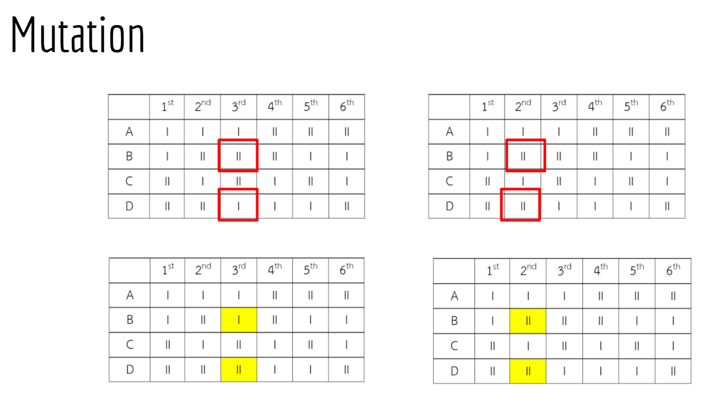
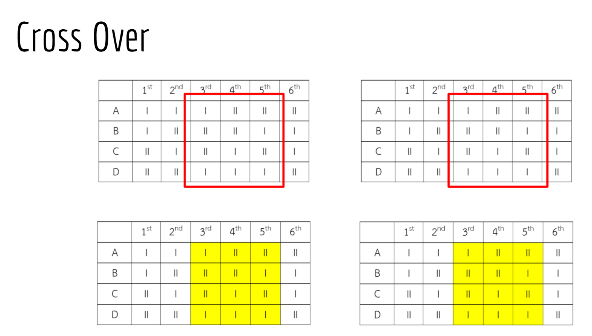
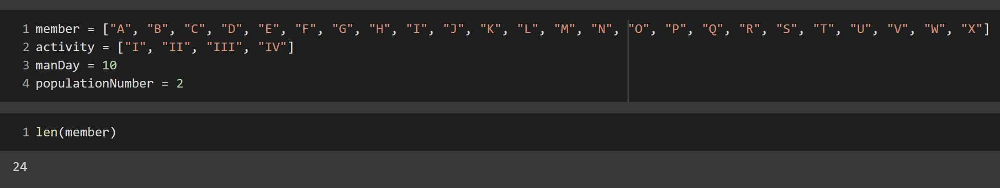
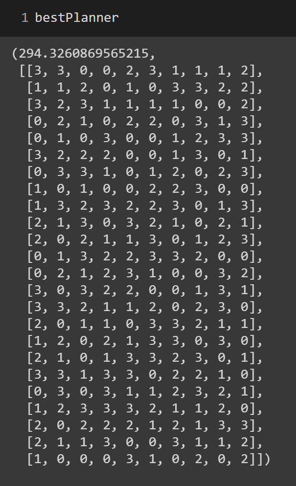
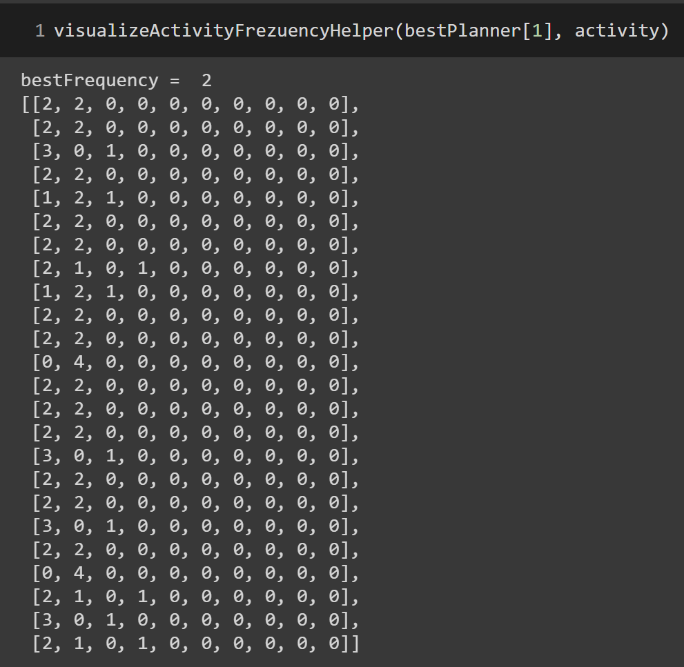
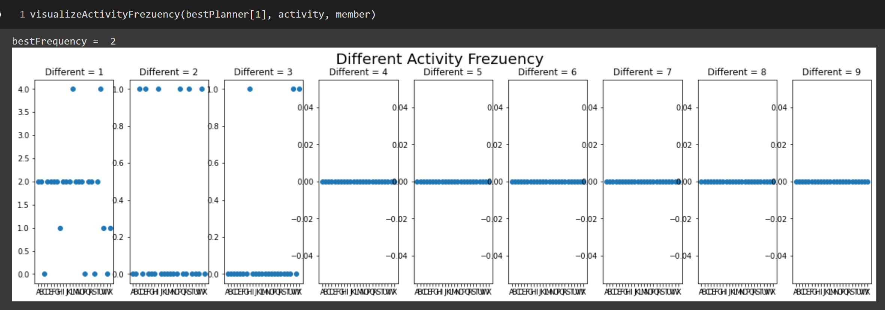

# HTC-matching
Grouping and Scheduling Problem with `Genetic Algorithm`

## Background
As a Hill Tribes Club, we form three camps per years. There are 4 activities in each day in the camp.

## Objective
To create a planner which manage that in each day who going to join which activity with `2` requirements
- Everyone equally joins every activity
- Everyone equally meets each other 

## Problem
We need the planner with the following requirement
- There are `4` activities
- Ther are `x` members
- There are `y` man-days
- Everyone equally joins every acticity
- Everyone equally meets each other

## Example
To illustrate, we will use `2` instead of `4` activities as an example
- There are `2` activities: `I` and `II`
- Ther are `4` members: `A`, `B`, `C` and `D`
- There are `6` man-days

With the requirements above, we can manually create the planner like this:

|       | **1st** | **2nd** | **3rd** | **4th** | **5th** | **6th** |
|:-----:|:-------:|:----:|:----:|:---------:|:---------:|:---------:|
| **A** | I | I | I | II | II | II |
| **B** | I | II | II | II | I | I |
| **C** | II | I | II | I | II | I |
| **D** | II | II | I | I | I | II |

So, we can create `check_activity` table that count the number of times that each member join each activity like this:

|       | **I** | **II** |
|:-----:|:-----:|:-----:|
| **A** | 3 | 3 |
| **B** | 3 | 3 |
| **C** | 3 | 3 |
| **D** | 3 | 3 |

And `check_meeting` table that count the number of times that each member meet each other like this:

|       | **A** | **B** | **C** | **D** |
|:-----:|:-----:|:-----:|:-----:|:-----:|
| **A** | - | 2 | 2 | 2 |
| **B** | - | - | 2 | 2 |
| **C** | - | - | - | 2 |
| **D** | - | - | - | - |

## Genetic Algorithm
With the large number of `members` or `man-days`, manully creating the planner is not effective anymore, so we use `Genetic Algorithm` (Traditional AI) to solve this problem. `Genetic Algorithm` consist of `3` step: `Mutation`, `Cross Over` and `Selection`

### Mutation
In this step, we randomly select the man-day, then randomly select `2` member in that day and switch the activity between them.

### Cross Over
In this step, we randomly select `2` slice from `2` planner and switch them.

### Selection
In this step, we use `fitnessValue = 2*checkAct + 1*checkMeet`

#### In `checkAct`
`BestValue = manDay/nActivity`

#### In `checkMeet`
`BestValue	=	nMeeting/nCell`

`nMeeting	=	combi((member/act), 2)*nActivity*manDay`

`nCell		=	nMember*(nMember - 1)/2`

## Demonstration

### Input

### Output

### Visualize 

#### Activity

#### Activity Frequency

For more information, you can look at `demo/Grouping and Scheduling Problem.pptx`
